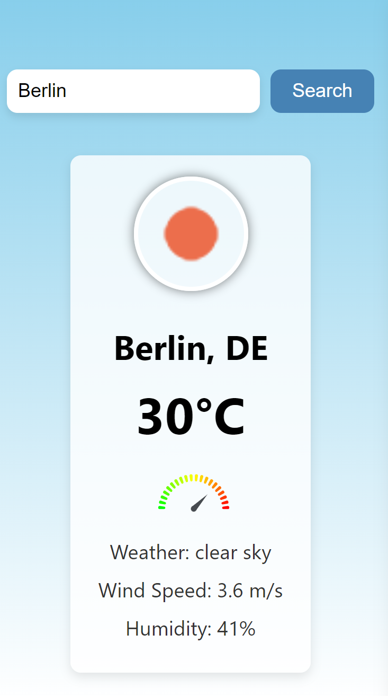

<div align="center">
  <h1> Simple Weather Predicting App 🌦️ </h1>
</div>
<p align="center">
  
</p>


## About

This is a simple weather predicting app built using React.js. It allows users to search for the current weather conditions in any city. The app uses data from the OpenWeather API and provides information like temperature, humidity, wind speed, and more.

---

## Features

- **Search by City**: Look up the current weather in any city.
- **Dynamic Backgrounds**: Background changes according to weather conditions.
- **Weather Icons**: Visual representations of the current weather.
- **Gauge Meter**: A gauge meter showing temperature range.
- **Responsive**: Works on both desktop and mobile devices.

---

## Tech Stack

- React.js
- Axios
- OpenWeather API
- GitHub Pages for deployment

---

## Installation and Setup

### Clone the repository

```bash
git clone https://github.com/Damika-Anupama/Simple-Weather-Predicting-App.git
```
Navigate to the project directory
```bash
cd Simple-Weather-Predicting-App
``````
Install dependencies
```bash
npm install
``````
Start the development server
```bash
npm start
``````
Deployment
- The app is deployed using GitHub Pages. You can view the live app here.

Contributing
- Pull requests are welcome. For major changes, please open an issue first to discuss what you would like to change.

## License

This project is licensed under the MIT License - see the [LICENSE](./LICENSE) file for details.
